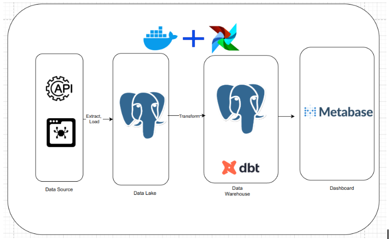

# StockWH Project

## Mô tả dự án

**StockWH** là một dự án xây dựng data warehouse để thu thập, xử lý và phân tích dữ liệu chứng khoán từ các công ty niêm yết tại Việt Nam (như HPG, FPT, LPB). Dự án sử dụng **Airflow** để quản lý pipeline ETL (Extract, Transform, Load) và **dbt** để transform dữ liệu thành các bảng dimension và fact, phục vụ cho việc phân tích tài chính và giá cổ phiếu.

### Mục tiêu
- Thu thập dữ liệu thô từ các nguồn như giá cổ phiếu, tin tức, báo cáo tài chính (income, balance, cash flow).
- Lưu trữ dữ liệu thô trong schema `raw` của database `stockwh`.
- Transform dữ liệu thành các bảng dimension (`dim_company`, `dim_date`) và fact (`fact_symbol`) trong schema `wh` của database `stockwh`.
- Cung cấp dữ liệu đã xử lý để phân tích, ví dụ: doanh thu, lợi nhuận, tác động của tin tức lên giá cổ phiếu.

### Công nghệ sử dụng
- **Airflow**: Quản lý pipeline ETL.
- **dbt**: Transform dữ liệu.
- **PostgreSQL**: Lưu trữ dữ liệu (database `stockwh`).
- **Python**: Viết script crawl và load dữ liệu (sử dụng thư viện `vnstock3`).
- **Docker**: Chạy Airflow và PostgreSQL trong container.

---

## Yêu cầu hệ thống

- **Docker** và **Docker Compose**: Để chạy Airflow và PostgreSQL.
- **Python 3.12**: Để chạy các script crawl và load.
- **dbt 1.6.0**: Để transform dữ liệu (tương thích với `cosmos`).
- **PostgreSQL**: Database `stockwh` để lưu trữ dữ liệu.
- **Astro CLI**: Để chạy project

---
